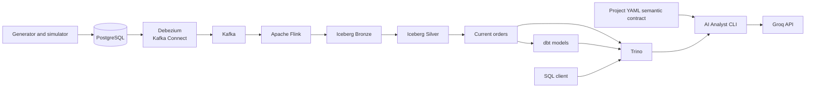

# Flowmart

[](https://github.com/ZJXDL/Flowmart/actions/workflows/ci.yml)

> A student portfolio project demonstrating an e-commerce data pipeline with change data capture, streaming, an Iceberg lakehouse, SQL analytics, and a small AI analyst.

Flowmart generates sample e-commerce activity in PostgreSQL, captures database changes with Debezium, streams them through Kafka and Flink, and stores analytical tables in Apache Iceberg backed by MinIO. Trino provides SQL access. Python modules add a semantic contract, an optional natural-language analyst, anomaly detection, and observability examples.

This is a **local development and learning project**, not a production service. The AI analyst is a command-line program; the repository does not contain a customer-facing web application.

## Contents

- [Architecture](#architecture)
- [What is implemented](#what-is-implemented)
- [Technology](#technology)
- [Run locally](#run-locally)
- [Query the lakehouse](#query-the-lakehouse)
- [Optional tools](#optional-tools)
- [CI and verification](#ci-and-verification)
- [Current limits](#current-limits)
- [Stop the stack](#stop-the-stack)

## Architecture



The Compose project and database use the internal name `atlas`; these are legacy identifiers in the configuration. The application and repository are named Flowmart.

## What is implemented

| Area | Project files | Purpose |
| --- | --- | --- |
| Source data | `apps/ecommerce-generator/` | Seeds categories, products, customers, orders, payments, and inventory; `simulator.py` can generate more transactions. |
| Change capture | `infrastructure/cdc/postgres-connector.json` | Configures Debezium to capture PostgreSQL changes and publish topics such as `atlas.public.orders`. |
| Bronze stream | `pipelines/bronze/` | Flink reads Debezium order events, decodes decimal values, and writes event rows to Iceberg. |
| Silver/current state | `pipelines/silver/sql/` | SQL jobs copy Bronze events and derive the latest non-deleted order per ID. |
| Gold analytics | `pipelines/gold/sql/daily_sales.sql` | SQL for daily order count, revenue, and average order value. |
| Analytics engineering | `dbt/models/`, `dbt/tests/` | dbt models and data tests for current orders and daily sales. |
| Semantic contract | `semantic/` | Project-owned YAML definitions for metrics, dimensions, and relationships; this is not dbt's official Semantic Layer. |
| AI analyst | `apps/ai-analyst/src/` | Optional CLI that builds constrained analytical queries, submits them to Trino, and drafts a natural-language answer using an LLM. |
| Quality examples | `quality/anomaly/`, `observability/` | Python detector, alert, metric, and dashboard-logic modules. These are code modules, not separately deployed services. |
| Local infrastructure | `docker-compose.yml` | Starts PostgreSQL, Kafka, Kafka Connect, Flink, Iceberg REST, MinIO, Trino, and Kafka UI. |
| CI/CD | `.github/workflows/ci.yml` | Validates the repository and publishes the custom Flink image to GHCR after successful pushes to `master`. |

The seed generator targets 6 categories, 31 products, 1,000 customers, and 5,000 orders. It uses the local demo database settings shown in `.env.example`.

The Bronze order event keeps the order identifiers and values alongside the Debezium operation and event timestamp. Silver retains the event history; the current-state job selects the newest event per order and filters deleted records.

## Technology

Versions below describe the tags in `docker-compose.yml`. Some images use the moving `latest` tag, so a fresh machine may pull a newer version.

| Component | Compose image/config |
| --- | --- |
| PostgreSQL | `postgres:17` |
| Debezium Kafka Connect | `quay.io/debezium/connect:3.3` |
| Kafka | `apache/kafka:4.1.0` |
| Flink | `flink:2.1.0-scala_2.12-java17` plus Flowmart's UDF and connector JARs |
| Iceberg REST catalog | `apache/iceberg-rest-fixture:latest` |
| Object storage | `minio/minio:latest` |
| SQL engine | `trinodb/trino:latest` |
| Kafka UI | `provectuslabs/kafka-ui:latest` |
| Analytics / AI | Python, SQL, YAML, Java; optional Groq API |

## Run locally

### Prerequisites

- Docker Desktop with Docker Compose v2
- Git
- Python 3.10 or newer for the generator and Python tools
- A Groq API key only if you want to use the real AI analyst

### 1. Get the project and start the services

PowerShell:

```powershell
git clone https://github.com/ZJXDL/Flowmart.git
cd Flowmart
if (-not (Test-Path .env)) { Copy-Item .env.example .env }
docker compose up -d --build
docker compose ps
```

The first build compiles the decimal-decoder UDF and downloads Flink connector dependencies. Wait for PostgreSQL, Kafka, Flink, and the other services to finish starting before continuing.

The sample credentials are for a local demo only. The generator, connector JSON, and pipeline configuration also contain matching development connection values; changing `.env` alone will not update every component. Do not expose this configuration to an untrusted network or reuse its credentials elsewhere.

### 2. Seed PostgreSQL

Run from the project root. PowerShell:

```powershell
py -m venv .venv
.\.venv\Scripts\Activate.ps1
python -m pip install -r apps/ecommerce-generator/requirements.txt
python apps/ecommerce-generator/generator.py
```

On macOS or Linux, replace `py` with `python3` and activate with `source .venv/bin/activate`.

### 3. Start CDC

Register the connector after the source data is seeded:

```powershell
curl.exe -sS -X POST -H "Content-Type: application/json" --data-binary "@infrastructure/cdc/postgres-connector.json" http://localhost:8083/connectors
```

Check its status:

```powershell
curl.exe -sS http://localhost:8083/connectors/atlas-postgres-cdc/status
```

The connector is configured for an initial snapshot. On a fresh Kafka Connect setup, it will snapshot existing rows and then publish new changes.

### 4. Start the Flink jobs

For a Bronze smoke run, submit the Bronze SQL file:

```powershell
docker compose exec -d flink-jobmanager /opt/flink/bin/sql-client.sh -f /opt/flowmart/pipelines/bronze/sql/orders_bronze.sql
```

The Bronze source uses `earliest-offset`, so a fresh job can read the retained order-topic history. Avoid launching duplicate copies of a streaming job; replaying events can append duplicate Bronze rows.

To run the complete Bronze → Silver → current-state flow, start the jobs in order and wait for each table/job to be ready before starting the next:

1. `pipelines/bronze/sql/orders_bronze.sql`
2. `pipelines/silver/sql/orders_silver.sql`
3. `pipelines/silver/sql/orders_current.sql`

**Resource note:** the Compose TaskManager is configured with **one task slot**. A running streaming job uses that slot, so the default setup cannot run all three jobs concurrently. To do that, increase `taskmanager.numberOfTaskSlots` in `docker-compose.yml` to at least 3 and make sure Docker Desktop has enough memory for the stack. The sample Flink process-memory settings are 768 MB for the JobManager and 1,024 MB for the TaskManager; increasing slots without available memory may make the local stack unstable.

Open the local tools in a browser:

| Tool | URL |
| --- | --- |
| Kafka UI | [http://localhost:8080](http://localhost:8080) |
| Flink dashboard | [http://localhost:8081](http://localhost:8081) |
| MinIO console | [http://localhost:9011](http://localhost:9011) |
| Trino API | [http://localhost:8082/v1/info](http://localhost:8082/v1/info) |

Other published ports are PostgreSQL `5433`, Kafka `9092`, Kafka Connect `8083`, Iceberg REST `8181`, and MinIO S3 API `9010`.

## Query the lakehouse

When the Iceberg tables have been created, use Trino's CLI from inside its container:

```powershell
docker compose exec trino trino --server http://localhost:8080 --user flowmart --execute "SHOW TABLES FROM iceberg.atlas"
```

Example Bronze query:

```powershell
docker compose exec trino trino --server http://localhost:8080 --user flowmart --execute "SELECT COUNT(*) FROM iceberg.atlas.bronze_orders"
```

The SQL in `pipelines/gold/sql/daily_sales.sql` can be run in Trino after `iceberg.atlas.silver_orders_current` is available. The dbt models are separate transformations over the same analytical data.

## Optional tools

### dbt

The repository includes `dbt_project.yml` and models, but the CI workflow does not install dbt or execute dbt runs. To run them locally, install `dbt-core` and `dbt-trino`, then create a local `flowmart` profile targeting Trino at `localhost:8082`, catalog `iceberg`, and schema `atlas`. Keep the profile outside the repository (for example, in `%USERPROFILE%\.dbt\profiles.yml` on Windows).

From the project root, run `dbt debug`, then `dbt run` and `dbt test` with that profile. The Iceberg source tables must exist first.

### AI Analyst

The real analyst uses Groq and requires `GROQ_API_KEY` to be set in the shell. It also requires the Trino container and the analytical tables to be available.

PowerShell:

```powershell
python -m pip install -r apps/ai-analyst/requirements.txt
$env:GROQ_API_KEY = "your-key"
python apps/ai-analyst/src/run_real_analyst.py
```

The default model is `openai/gpt-oss-120b`; `FLOWMART_LLM_MODEL` can override it. The query tool applies basic read-only SQL checks. Those checks are useful for this demo but are not a production security boundary.

### Anomaly detection and observability

The repository includes statistical detection, alert-building, metric, and dashboard-logic modules with self-tests. Compose does not schedule them as background services or include a Prometheus/Grafana deployment.

## CI and verification

GitHub Actions runs on pushes and pull requests targeting `main` or `master`. Its checks validate the Compose configuration, compile Python modules, build the Flink image, and run the repository's semantic, analyst, anomaly, and observability validation scripts.

A successful push to `master` also publishes `ghcr.io/zjxdl/flowmart-flink` with `latest` and commit-SHA tags. This is image publishing; the workflow does not deploy Flowmart to a cloud host or start the full service stack as an end-to-end test.

**Latest manual smoke check (2026-09-29):** a synthetic PostgreSQL change was observed in Kafka and committed by Flink to an isolated Iceberg Bronze table. The follow-up Silver and Trino checks were inconclusive because Docker Desktop and local service endpoints stopped responding. The full live pipeline is therefore not certified by that run or by CI.

## Current limits

- This is a single-machine demo stack; it does not provide production authentication, high availability, or secret management.
- The default Flink TaskManager has one slot, as described above.
- Several Compose images use `latest`, so image versions can change between fresh installs.
- The generated dataset is for pipeline demonstrations, not a long historical time series. Anomaly results that need a long baseline require more historical data.
- CI covers code/config validation and the Flink image build, not a live Postgres-to-Trino integration run.

## Stop the stack

Stop containers while preserving the named database, Kafka, and MinIO volumes:

```powershell
docker compose down
```

`docker compose down -v` removes those volumes and deletes the local demo data. Use it only when you intentionally want a fresh reset.

## Project structure

```text
.
├── .github/workflows/ci.yml
├── apps/
│   ├── ai-analyst/src/
│   └── ecommerce-generator/
├── dbt/
│   ├── models/
│   └── tests/
├── infrastructure/
│   ├── cdc/
│   ├── flink/
│   ├── postgres/
│   └── trino/catalog/
├── observability/
├── pipelines/
│   ├── bronze/
│   ├── gold/sql/
│   └── silver/sql/
├── quality/anomaly/
├── semantic/
├── docker-compose.yml
├── dbt_project.yml
└── README.md
```

---

Built by [ZJXDL](https://github.com/ZJXDL) as a student portfolio project focused on data engineering and modern analytics.

